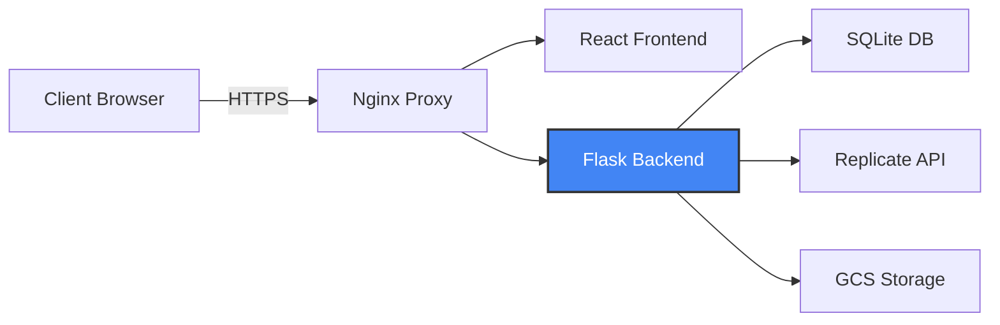
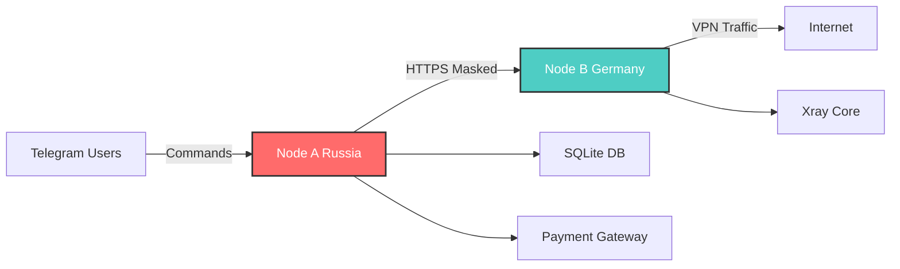

# 👋 Привет

### 🚀 Full-Stack Developer | Cloud Architect | VPN Infrastructure Specialist

---

## 🎯 О Мне

Разработчик с опытом в **облачных архитектурах**, **безопасности** и **автоматизации**. Работаю с production-ready системами, Clean Architecture и DevOps практиками.

### 💻 Технологии

- **Backend**: Python (Flask, AsyncIO), RESTful API, Microservices
- **Frontend**: React 19, TailwindCSS, Modern JavaScript
- **Cloud**: Google Cloud Platform (GCE, GCS, Secret Manager)
- **DevOps**: Docker, Docker Compose, CI/CD (GitHub Actions)
- **Security**: OAuth 2.0, RBAC, OWASP Top 10
- **VPN**: Xray Core, VLESS, Shadowsocks

---

## 🛠️ Технологический Стек

### Languages & Frameworks

### Cloud & Infrastructure

### Databases & Tools

---

## 🌟 Проекты

### 🤖 AI Tools Platform
> **Enterprise-grade AI model aggregation platform**

Унифицированная платформа для работы с генеративными AI-моделями (Replicate, OpenAI, Vertex AI). Реализована Clean Architecture с Service Layer паттерном, OAuth 2.0 аутентификацией и RBAC системой.

**Технологии**: React 19, Flask, Docker, GCP, Replicate API  
**Особенности**: Multi-provider abstraction, Rate limiting, Credits system, CI/CD

**Архитектурные решения**:
- Service Layer для изоляции бизнес-логики
- Provider Abstraction для легкого добавления новых AI-провайдеров
- Асинхронная генерация с polling механизмом
- Structured logging (JSON) для observability

📄 [Детальный Case Study →](https://github.com/kets-kets/portfolio-case-studies/blob/main/ai-tools-platform.md)

---

### 🔐 QentVPN
> **Split Core VPN architecture for censorship circumvention**

Коммерческий VPN-сервис с архитектурой Split Core: географически распределённые узлы (Node A в России, Node B в Германии) с маскировкой трафика под HTTPS.

**Технологии**: AsyncTeleBot, Flask, Marzban, Xray Core, Docker  
**Особенности**: Dual protocol (VLESS/Shadowsocks), Telegram Mini App, Payment automation

**Архитектурные решения**:
- Split Core для обхода блокировок на уровне IP
- HTTPS маскировка VPN-трафика (httpx)
- Dual protocol strategy (VLESS Reality + Shadowsocks)
- Асинхронная архитектура (AsyncIO)
- OWASP Top 10 compliance

📄 [Детальный Case Study →](https://github.com/kets-kets/portfolio-case-studies/blob/main/qentvpn-architecture.md)

---

## 🎓 Подход к Разработке

Использую **Clean Architecture** и **SOLID** принципы:

- **Separation of Concerns**: Service Layer, Repository Pattern
- **Type Safety**: MyPy strict mode для Python
- **Security**: Zero-trust секреты, OWASP compliance
- **Observability**: Structured logging, health checks

---

## 🔧 Библиотеки

### 📦 [telegram-payment-handler](https://github.com/kets-kets/telegram-payment-handler)
Type-safe библиотека для обработки платежей в Telegram (ЮKassa)

### 🤖 [ai-provider-sdk](https://github.com/kets-kets/ai-provider-sdk)
Унифицированный SDK для работы с AI-провайдерами (Replicate, OpenAI, Vertex AI)

---

## 📫 Контакты

---

**Разработка**: Cloud Architecture | VPN Infrastructure | AI Integration | DevOps Automation

